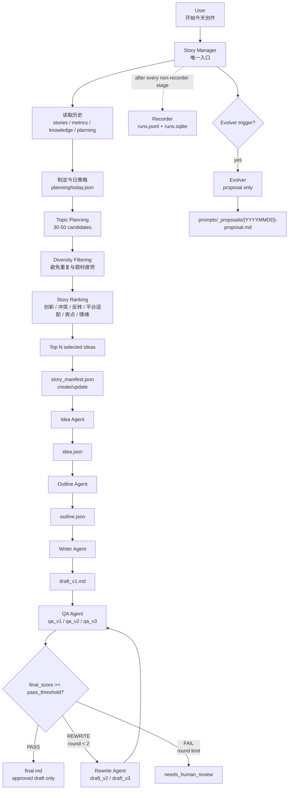

# 系统总览

Story Forge V1.5 由 Story Manager 作为唯一入口，升级为“自动内容策划 + 自动故事生产系统”。用户最终只需要触发一个动作：`开始今天创作`。Story Manager 先读取历史数据和规划资料，生成当天创作策略，再在内部完成 Topic Planning、Diversity Filtering 和 Story Ranking，最后只把 Top N 选题送入原有 Idea → Outline → Writer → QA → Rewrite → Recorder → Evolver 流程。

其他 agent 不由用户直接调用，也不承担选题策划职责。Idea、Outline、Writer、QA、Rewrite、Recorder 和 Evolver 仍保持原有边界：Idea 产出 `idea.json`；Outline 产出 `outline.json`；Writer 写 `draft_v1.md`；QA 按轮次写 `qa_v1.json`、`qa_v2.json` 或 `qa_v3.json`；Rewrite 最多执行 2 次，产出 `draft_v2.md`、`draft_v3.md`；Recorder 记录每个非 Recorder 阶段；Evolver 只在条件满足时输出 proposal，不自动覆盖 prompt 或 rules。

Story Manager 使用 `planning/today.json` 表达当天准备创作什么，使用 `story_manifest.json` 中的 `pass_threshold` 作为单篇故事最终流程判定阈值，V1.5 默认仍为 90。Prompt 使用 `prompts/{type}/vN.md` 版本化，升版必须由用户审核后手动新增 `vN+1.md`。Metrics 可用 `sqlite3 metrics/runs.sqlite` 和 `metrics/schema.sql` 查询运行成本、耗时、分数与 prompt 版本效果。

# 项目规则

## 项目定位

- 本项目是 Story Forge V1.5 的最小可运行规格骨架。
- V1.5 在 V1 的故事生产流程前新增 Content Planning Layer，使系统从“自动写故事”升级为“自动内容策划 + 自动故事生产系统”。
- V1.5 只包含文件结构、agent 规则、规则文档、prompt 模板、流程说明、manifest 模板、planning 规划文件和 metrics schema。
- V1.5 不包含真实执行代码，不写 Python、JavaScript、TypeScript 或自动化 pipeline 脚本。
- V1.5 不新增 TopicPlannerAgent、RankingAgent、DiversityAgent；这些能力属于 Story Manager 的内部职责。

## 调度入口

- Story Manager 是唯一入口。
- 用户只向 Story Manager 下达任务，推荐任务形态为 `开始今天创作`。
- Idea、Outline、Writer、QA、Rewrite、Recorder 和 Evolver 不由用户直接调用。
- Story Manager 不应直接开始 Idea；必须先读取历史数据并制定今日创作策略。
- Story Manager 可在内部完成历史分析、今日策略、Topic Planning、Diversity Filtering 和 Story Ranking。
- Story Manager 不直接写正文，不修改其他 agent 已生成的内容，只负责内容策划、调度、状态检查和 manifest 维护。
- `final.md` 只能由已通过 QA 的当前 draft 原样确认或复制得到。

## Content Planning Layer

- Story Manager 每次开始当天创作前读取 `stories/`、`metrics/`、`planning/`，以及可选的 `knowledge/`。
- 若 `knowledge/` 不存在或为空，Story Manager 视为暂无额外知识输入，不得中断流程。
- Story Manager 分析最近 7 天和最近 30 天的题材分布、重复题材、高质量题材、低分题材、空缺题材和疲劳题材。
- Story Manager 生成或更新 `planning/today.json`，写明今天计划创作的题材、数量、避免题材、提升目标和原因。
- Story Manager 可参考 `planning/weekly.json`、`planning/monthly.json` 和 `planning/strategy.md` 制定更长期的题材轮换策略。
- Topic Planning 一次生成 30 到 50 个候选选题，但这些候选不是正式故事产物。
- Diversity Filtering 用于过滤近期重复、连续多天过密、同质化过强或与今日策略冲突的候选。
- Story Ranking 根据创新度、冲突、反转、平台适配、爽点和情绪强度综合排序。
- 只有进入 Top N 的候选，才允许进入正式 Idea → Outline → Writer → QA → Rewrite 流程。

## 全局命名

- `story_id = {YYYYMMDD}-{slug}`。
- `slug` 由正式 `idea.title` 生成，使用小写英文、数字和连字符，长度不超过 30 个字符。
- 每篇故事产物路径固定为 `stories/{YYYYMMDD}/{slug}/`。
- 同一故事的所有阶段产物必须写在该目录下。
- 每篇故事必须维护 `story_manifest.json`，由 Story Manager 在每个阶段开始和结束后更新。
- 初稿命名为 `draft_v1.md`；第 1 次返工为 `draft_v2.md`；第 2 次返工为 `draft_v3.md`。
- QA 最多评估 3 轮，命名为 `qa_v1.json`、`qa_v2.json`、`qa_v3.json`。
- V1.5 默认通过阈值为 90，记录在 `story_manifest.json` 的 `pass_threshold`。

## Planning 文件

- `planning/today.json`：当天创作计划，记录历史分析窗口、计划题材、候选池、过滤结果、排名结果和 Top N。
- `planning/weekly.json`：本周策略，记录题材分布目标、质量目标、轮换节奏和需要避免的疲劳模式。
- `planning/monthly.json`：长期策略，记录月度内容方向、核心题材、实验题材、质量基准和风险观察。
- `planning/strategy.md`：说明 Story Manager 如何制定策略、如何评分、如何避免重复，以及未来如何接入热点、搜索趋势、历史阅读数据和平台表现。

## Prompt 版本管理

- Prompt 模板放在 `prompts/{category}/vN.md`。
- Agent 读取同类别最新版，例如 `prompts/style/v*.md` 中数字最大的版本。
- 旧 prompt 不覆盖、不删除；每次有效改动必须新建版本。
- Evolver 只能写 proposal，不能直接改 `rules/` 或已有 `prompts/`。

## Metrics 记录

- 每个非 Recorder 的 agent 阶段完成后必须调用 Recorder。
- Recorder 同步写两份记录：追加 `metrics/runs.jsonl`，并写入 `metrics/runs.sqlite`。
- Recorder 绝不记录自己的 recorder 阶段，避免自循环。
- SQLite schema 以 `metrics/schema.sql` 为准。
- 查询优先使用 `sqlite3 metrics/runs.sqlite` 加手写 SQL；V1.5 不提供 Web 看板。

## 硬限制

- 不接入番茄小说或任何第三方发布平台。
- 不自动发布、不自动绕过任何网站风控。
- 不写真实执行脚本，不创建 pipeline 运行代码。
- 不新增业务 agent 来拆分 Topic Planning、Diversity Filtering 或 Story Ranking。
- 不保存真实 API key、token、cookie、私钥或生产凭据。
- 不自动覆盖规则或 prompt 版本，所有升版必须经过用户审核。

## 文档语言

- 面向用户和后续 agent 的文档默认使用中文。
- 文件名、字段名、路径、SQL 表名和代码式标识符使用英文。
